# TomoMergeModel

Authors: Sevan Adourian, Pranav Mucharla

TomoMergeModel merges a regional tomography model into a global tomography model using spherical-harmonic blending and geographic windowing.

## What Is In This Package

This repo centers around only three classes:

- `Dataset` ([Dataset.py](Dataset.py))
- `MergeMethods` ([MergeMethods.py](MergeMethods.py))
- `ConfigParams` ([ConfigParams.py](ConfigParams.py))

## Quick Start

### 1. Create the conda environment

All dependencies are handled by the conda environment.

```bash
conda env create -f environment.yaml
conda activate mergemod
```

### 2. Prepare NetCDF files

You need at least:

- one global model NetCDF
- one regional model NetCDF

You can use files already in this repo under [Data/netcdf](Data/netcdf), or add your own.

#### Option A: Use included sample files

Example files already present in this repository:

- [Data/netcdf/semucb-2014-ucb-vs.nc](Data/netcdf/semucb-2014-ucb-vs.nc)
- [Data/netcdf/CANVAS_15-60s_400km.nc](Data/netcdf/CANVAS_15-60s_400km.nc)

#### Option B: Download your own model files

Global and regional tomography models are commonly distributed from model/project pages (for example IRIS EMC model pages or project repositories).

Example pattern:

```bash
# PowerShell examples (replace URLs with the model file links you want)
curl.exe -L "https://example.org/path/to/global_model.nc" -o "Data/netcdf/global_model.nc"
curl.exe -L "https://example.org/path/to/regional_model.nc" -o "Data/netcdf/regional_model.nc"
```

If your source data is ASCII, you can also adapt [ascii_to_netcdf.py](ascii_to_netcdf.py) to convert it to NetCDF first.

### 3. Run a merge script

You can run [main.py](main.py) directly, or create a minimal script like this:

```python
from Dataset import Dataset
from MergeMethods import MergeMethods
from ConfigParams import ConfigParams


def main() -> None:
	depths = [150]

	global_mod = Dataset(
		file_path="Data/netcdf/semucb-2014-ucb-vs.nc",
		model_type=Dataset.GLOBAL,
		depth_units="km",
	)

	regional_mod = Dataset(
		file_path="Data/netcdf/alaska.nc",
		model_type=Dataset.REGIONAL,
		depths=depths,
		depth_units="km",
		global_model=global_mod,
	)

	conf = ConfigParams(
		reg_lmax=239,
		win_lmax=30,
		lon_bounds=(197.5, 230.5),
		lat_bounds=(52.65, 71.55),
		win_type="spherical",
		mask_mode="bounds",
	)

	merger = MergeMethods(
		model_one=regional_mod,
		model_two=global_mod,
		config_params=conf,
		regional_variable="Vs",
		global_variable="vsv",
	)

	merged = merger.merge()
	merged.save_model("merged_output.nc")


if __name__ == "__main__":
	main()
```

Run it:

```bash
python main.py
# or
python your_merge_script.py
```

## Architecture

The package is easiest to understand with two complementary views:

- A static architecture view of class dependencies and external libraries.
- A runtime flow view of the merge pipeline executed for each depth slice.

### Core Class and Dependency Diagram



### Runtime Merge Flow


## Notes

- Coordinate and variable names can differ across models. Ensure the variable names you pass to `MergeMethods` exist in your input NetCDF files.
- Depth units must be set correctly (`"m"` or `"km"`) when creating `Dataset` objects.

