# geostitch

Authors: Sevan Adourian, Pranav Mucharla, Dan Frost

geostitch is a utility package used to seemlessly merge any regional geo-referenced dataset into a global model using spherical-harmonic blending and geographic windowing. It is built on top of pyshtools [[1]](#1).

The examples are taken from seismic tomography, but the package is usable for any geo-referenced dataset (climate, gravity, satellite data, etc...), granted that they are stored in a netcdf file.

Originally, this package was developed for seismic tomography. Some examples and terminology still reflect that origin.

## Best Suited Data

geostitch is best suited for scalar geospatial fields that:

- are defined on latitude/longitude grids (or can be interpolated to regular lat/lon grids),
- can be represented on a spherical domain,
- are available as regional and global datasets with compatible physical meaning,
- are stored in NetCDF-compatible structures.

Typical examples include seismic velocity anomalies, climate fields, gravity/geoid perturbations, and satellite-derived Earth fields.

## Assumptions

- Spherical-harmonic representation is appropriate for the target field and scales of interest.
- Regional and global inputs describe the same physical quantity (with consistent units/sign conventions).
- Windowing and blending parameters (`reg_lmax`, `win_lmax`, and blend settings) are tuned for the target application.
- Interpolation to regular grids does not introduce unacceptable artifacts for the intended interpretation.

## What Is In This Package

This repo centers around only three classes:

- `Dataset` (`geostitch/Dataset.py`)
- `MergeMethods` (`geostitch/MergeMethods.py`)
- `ConfigParams` (`geostitch/ConfigParams.py`)

## Quick Start

### 1. Create the conda environment

All dependencies are handled by the conda environment.

```bash
conda env create -f environment.yml
conda activate mergemod
```

### 2. Prepare NetCDF files

You need at least:

- one global model NetCDF
- one regional model NetCDF

You can use files already in this repo under [data](data), or add your own.

#### Option A: Use included sample files

Example files already present in this repository:

- [data/semucb-2014-ucb-vs.nc](data/semucb-2014-ucb-vs.nc)
- [data/CANVAS_15-60s_400km.nc](data/CANVAS_15-60s_400km.nc)

#### Option B: Download your own model files

Global and regional tomography models are commonly distributed from model/project pages (for example IRIS EMC model pages or project repositories).

Example pattern:

```bash
# PowerShell examples (replace URLs with the model file links you want)
curl.exe -L "https://example.org/path/to/global_model.nc" -o "data/global_model.nc"
curl.exe -L "https://example.org/path/to/regional_model.nc" -o "data/regional_model.nc"
```

If your source data is ASCII, you can also adapt [ascii_to_netcdf.py](ascii_to_netcdf.py) to convert it to NetCDF first.

### 3. Run a merge script

You can run [`example/main.py`](example/main.py) directly, or create a minimal script like this:

```python
from geostitch.Dataset import Dataset
from geostitch.MergeMethods import MergeMethods
from geostitch.ConfigParams import ConfigParams


def main() -> None:
	depths = [150]

	global_mod = Dataset(
		file_path="data/semucb-2014-ucb-vs.nc",
		model_type=Dataset.GLOBAL,
		depth_units="km",
	)

	regional_mod = Dataset(
		file_path="data/alaska.nc",
		model_type=Dataset.REGIONAL,
		depths=depths,
		depth_units="km",
		global_model=global_mod,
	)

	conf = ConfigParams(
		reg_lmax=239,
		win_lmax=30,
		lon_bounds=(197.5, 230.5),
		lat_bounds=(52.65, 71.55),
		win_type="spherical",
		mask_mode="bounds",
	)

	merger = MergeMethods(
		model_one=regional_mod,
		model_two=global_mod,
		config_params=conf,
		regional_variable="Vs",
		global_variable="vsv",
	)

	merged = merger.merge()
	merged.save_model("merged_output.nc")


if __name__ == "__main__":
	main()
```

Run it:

```bash
python example/main.py
# or
python your_merge_script.py
```

## Architecture

The package is easiest to understand with two complementary views:

- A static architecture view of class dependencies and external libraries.
- A runtime flow view of the merge pipeline executed for each depth slice.

### Core Class and Dependency Diagram


### Runtime Merge Flow



## Notes

- Coordinate and variable names can differ across models. Ensure the variable names you pass to `MergeMethods` exist in your input NetCDF files.
- Depth units must be set correctly (`"m"` or `"km"`) when creating `Dataset` objects.

## References
<a id="1">[1]</a> 
Meschede, M. and Wieczorek, M., 2018.
SHTools: Tools for Working with Spherical Harmonics.
Geochemistry, Geophysics, Geosystems,
AGU and the Geochemical Society.
